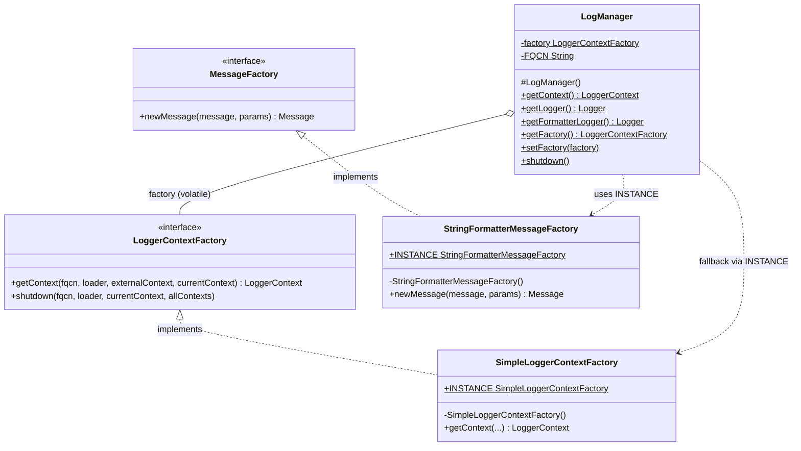
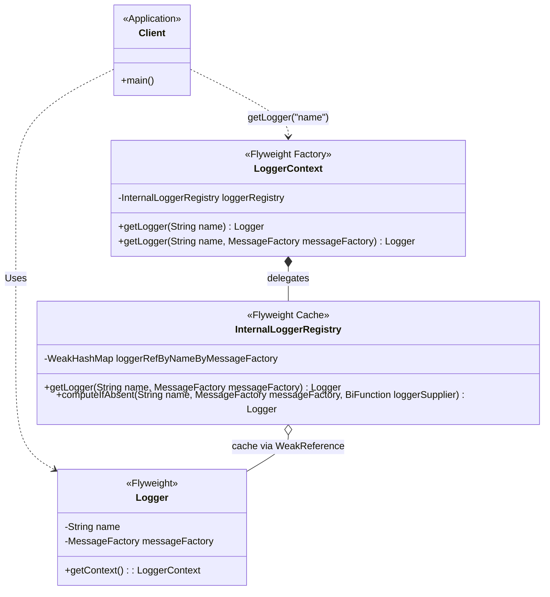

# Report: Software Design

**Note** Max 2500 words except diagrams.

**After the word limit, teachers reserve the right to stop reading, which may affect the teams’ grade**

---

## Table of Contents

- [Report: Software Design](#report-software-design)
  - [Table of Contents](#table-of-contents)
  - [1. Dependencies](#1-dependencies)
    - [1.1 Methodology and Tools](#11-methodology-and-tools)
    - [1.2 Code Dependencies](#12-code-dependencies)
      - [Most dependent files (Highest Fan-out)](#most-dependent-files-highest-fan-out)
      - [Least dependent files (Lowest Fan-out)](#least-dependent-files-lowest-fan-out)
    - [1.3 Knowledge Dependencies](#13-knowledge-dependencies)
  - [2. Patterns](#2-patterns)
    - [2.1 Pattern 1: Singleton](#21-pattern-1-singleton)
    - [Context](#context)
    - [2.3 Pattern 3: Flyweight](#23-pattern-3-flyweight)
    - [Context](#context-1)
  - [3. Summary](#3-summary)

---

## 1. Dependencies

### 1.1 Methodology and Tools

<!-- _Describe the methods and tools used to analyze the dependencies and the results obtained._ -->

In the following sections, some custom Python scripts were used to perform static analyses of the code.

For **Code Dependencies**, a static analysis was performed utilizing regular expressions to identify imports within the two core components: log4j-core and log4j-api. Tests and `package-info.java` were excluded from this analysis as they were not considered important for the purpose of this study.
However, there are some limitations regarding the use of Python scripts compared to the use of professional tools. In fact, in Java language, the imports of intra-package classes are not required. This can cause some variations of the results. Regardless of this, the analysis remains a good metric for the inter-package relationships.

For **Knowledge Dependencies**, the commit history was extracted from the Apache Log4j Git Repository. Using a Python script, it was possible to filter the commit history for `.java` files and to track how often two files were modified together in the same commit. A minimum threshold of 15 "co-changes" was added to focus only on the most meaningful pairs.

### 1.2 Code Dependencies

<!-- _Evaluate code dependencies based on the imports in the source code._

- **Most/Least dependent files:** _Indicate which files have the most or least dependencies and explain why._  -->

#### Most dependent files (Highest Fan-out)

_Base path_: ./log4j-core/src/main/java/org/apache/logging/log4j/core

1. config/`AbstractConfiguration.java` - 43 internal imports
2. config/`LoggerConfig.java` - 32 internal imports
3. `LoggerContext.java` - 31 internal imports
<!-- 4. layout/`Rfc5424Layout.java` - 31 internal imports
4. appender/`SmtpAppender.java` - 30 internal imports -->

The most coupled file is AbstractConfiguration.java, the _orchestrator_ of the system, indeed, it initializes, configures, starts, stops and sets up the configuration logging.
The high Fan-Out is justified because AbstractConfiguration.java is the integration point of the framework. (Facade pattern <-- too be removed :) )

Unlike AbstractConfiguration.java, whose coupling is about assembling the system, LoggerConfig.java is used as a _dispatcher_ seated between the API layer and the Core layer. It receives log events and forwards them to the appropriate Appenders, applying filters.

The LoggerContext.java manages the _runtime lifecycles_ of the logging system: it registry of active Loggers and acts as a bridge between the API and Core infrastructure.

#### Least dependent files (Lowest Fan-out)

_Base path_: ./log4j-api/src/main/java/org/apache/logging/log4j

1. `BridgeAware.java` - 0 internal imports
2. `LoggingException.java` - 0 internal imports
3. internal/`LogManagerStatus.java` - 0 internal imports
   <!-- 3. `CloseableThreadContext.java` - 0 internal imports -->
   <!-- 4. `Marker.java` - 0 internal imports -->

BridgeAware.java is an interface with a single method, _setEntryPoint_, and no imports. Since it is an interface, no implementation, there is no need to import any other classes. This maximise reusability.

LoggingException.java is an exception class that extends the Java's standard _RuntimeException_.
Responsable for encapsulate error message caught anywhere in the system.

LogManagerStatus.java is an internal utility that traks when LogManager has been initialized. This class can be accessible in anytime since it does not depends on anything else classes. This could be an example of the Single Responsibility Principle (SRP).

### 1.3 Knowledge Dependencies

_Evaluate knowledge dependencies based on co-change (how often two files are modified together in the same commit)._

- **Inconsistencies:** _Which knowledge dependencies are inconsistent with the code dependencies?_

<!-- ## 2. Patterns

_Identify at least 4 instances of design patterns in the code._ _Include links to the source code for each._

### 2.1 Pattern 1: [Pattern Name]

- **Roles:** _Which classes play which role?_
- **Problem Solved / Rationale:** _Why is this pattern used? What problem does it solve?_
- **Alternatives:** _Is there an alternative? What would be the pros and cons?_

_(Repeat the structure for Patterns 2, 3, and 4)_ -->

## 2. Patterns

### 2.1 Pattern 1: Singleton

### Context

Log4j is a logging framework that serves as a centralized entry point for all logging operations in an application. The framework needs to provide global access to logger instances and configuration management.

LogManager.java is the anchor point for the Log4j logging system. The most common usage of this class is to obtain a named Logger.

- **Roles:**
  - **Singleton:** `SimpleLoggerContextFactory.java` and `StringFormatterMessageFactory.java`. <br> These classes implement the pattern by encapsulating their single instance within a static and final field conventionally named _INSTANCE_.

```java
      //Singleton instance of StringFormatterMessageFactory.java
      public static final StringFormatterMessageFactory INSTANCE = new StringFormatterMessageFactory();
      // Singleton instance of SimpleLoggerContextFactory.java
      public static final SimpleLoggerContextFactory INSTANCE = new SimpleLoggerContextFactory();
```

- **Client:** `LogManager.java`. <br> Acts as the Singleton consumer, invoking `SimpleLoggerContextFactory.INSTANCE` as a fallback mechanism or `StringFormatterMessageFactory.INSTANCE` for specific message formatting.

```java
      // Returns a formatter Logger with the specified name.
      public static Logger getFormatterLogger(final String name) {
          return name == null
                  ? getFormatterLogger(StackLocatorUtil.getCallerClass(2))
                  : getLogger(name, StringFormatterMessageFactory.INSTANCE);
      }
      // Returns the current LoggerContext.
      public static LoggerContext getContext() {
          try {
              return factory.getContext(FQCN, null, null, true);
          } catch (final IllegalStateException ex) {
              LOGGER.warn("{} Using SimpleLogger", ex.getMessage());
              return SimpleLoggerContextFactory.INSTANCE.getContext(FQCN, null, null, true);
          }
      }
```

**Example of _getFormatterLogger()_**

```java
      import org.apache.logging.log4j.LogManager;
      import org.apache.logging.log4j.Logger;
      public class ReportService {
          // Static logger for the class
          // Since getFormmatterLogger() is Singleton, no overhead
          private static final Logger log = LogManager.getFormatterLogger(ReportService.class);
          public static void main(String[] args) {
              double balance = 1234.56;
              // Use of well-formatted log message
              log.info("Saldo: %.2f EUR", balance);
          }
      }
```

**Example of _getFormatterLogger()_**

```java
      import org.apache.logging.log4j.LogManager;
      import org.apache.logging.log4j.spi.LoggerContext;
      public class Main {
          public static void main(String[] args) {

              LoggerContext context = LogManager.getContext();

              context.getLogger("TestLogger").info("Test riuscito!");
          }
      }
```

- **Problem Solved / Rationale:** -
  - _Problems:_
    - Creating a new object via the `new` keyword every time `LogManager` needs to be called would result in unnecessary memory waste and overhead for the Garbage Collector, especially in a logging framework invoked thousands of times per second.
    - Multiple instantiation of LogManager would lead to inconsistent states and different configurations.
  - _Solution:_
    - The Singleton pattern ensures that one and only one instance of this class exists shared across the entire Java Virtual Machine (JVM). This guarantees a minimal memory footprint, optimal performance, and provides `LogManager` with a unique, global, and immediate access point.

- **Alternatives:**
  - _Static Class:_ The factory could be turned into a class with only static methods.
    - _Pro:_ Simple and fast to implement.
    - _Cons:_ Static methods cannot implement interfaces (e.g. the `LoggerContextFactory` or `MessageFactory` interfaces implemented respectively in _SimpleLoggerContextFactory_ or _StringFormatterMessageFactory_). <br> The Singleton allows leveraging polymorphism, a requirement heavily used in Log4j.
  - _Dependency Injection (DI):_ Inject the factory instance where needed using a Dipendency Injection framework.
    - _Pro:_ Reduces tight coupling and greatly simplifies isolation during testing (Mocking).
    - _Cons:_ In a base-level logging infrastructure, requiring dependency injection would force developers to pass the instance to every single class in their application domain, violating ease of use and polluting business logic with infrastructure code (boilerplate).



### 2.3 Pattern 3: Flyweight

### Context

`LoggerContext.java` acts as the manager for loggers, ensuring that requests for the same logger name always return the exact same shared instance.

- **Roles:**
  - **Flyweight Factory:** `LoggerContext.java`, utilizing `InternalLoggerRegistry.java`.
    <br> When a client requests a logger, the factory checks if a logger with that specific name already exists in the registry. If it does, it returns the existing instance; if not, it creates a new one, stores it, and returns it.

```java
      // LoggerContext.java
      public Logger getLogger(final String name, @Nullable final MessageFactory messageFactory) {
        final MessageFactory effectiveMessageFactory =
                messageFactory != null ? messageFactory : DEFAULT_MESSAGE_FACTORY;
        // computeIfAbsent is the Flyweight pattern here.
          // It shares existing instances and only instantiates new ones when strictly necessary.
        return loggerRegistry.computeIfAbsent(name, effectiveMessageFactory, this::newInstance);
    }
```

```java
      // InternalLoggerRegistry.java
        public Logger computeIfAbsent(
              final String name,
              final MessageFactory messageFactory,
              final BiFunction<String, MessageFactory, Logger> loggerSupplier) {

          // If the logger already exists, it returns the existing Flyweight instance without locking.
          @Nullable Logger logger = getLogger(name, messageFactory);
          if (logger != null) {
              return logger;
          }

          Logger newLogger = loggerSupplier.apply(name, messageFactory);

          // ...

          // Inserting the new instance into a WeakHashMap
          loggerRefByName.put(name, new WeakReference<>(logger = newLogger, staleLoggerRefs));

          return logger;

          // ...
      }

```

- **Flyweight:** `Logger.java` the instance created and returned by `LoggerContext.java`. It is represented by the name and by the `MessageFactory`

- **Client:** `LogManager.java` or any application classes that request the creation of a logger using `LogManager.getLogger()`.

**Example of Flyweight usage (Client)**

```java
      import org.apache.logging.log4j.LogManager;
      import org.apache.logging.log4j.Logger;
      public class Main {
          public static void main(String[] args) {
              Logger logger1 = LogManager.getLogger("TestLogger");
              Logger logger2 = LogManager.getLogger("TestLogger");

              // Both logger1 and logger2 refer to the same instance, demonstrating the Flyweight pattern.
              System.out.println(logger1 == logger2); // Output: true
          }
      }
```

- **Problem Solved / Rationale:**
  - _Problems:_
    - Creating a unique `Logger` object for every class in the application would cause a massive memory footprint and slow bootstrapping time
  - _Solution:_
    - The Flyweight pattern minimizes memory usage by sharing loggers with the same name and message.

- **Alternatives:**
  - _No Caching_ instantiating a new Logger every time `getLogger()` is called:
    - _Pro:_ Less complex code, no need to manage complex lock
    - _Cons:_ Massive memory waste and performance degradation



## 3. Summary

_Summarize the results regarding the two design aspects (Dependencies and Patterns)._
