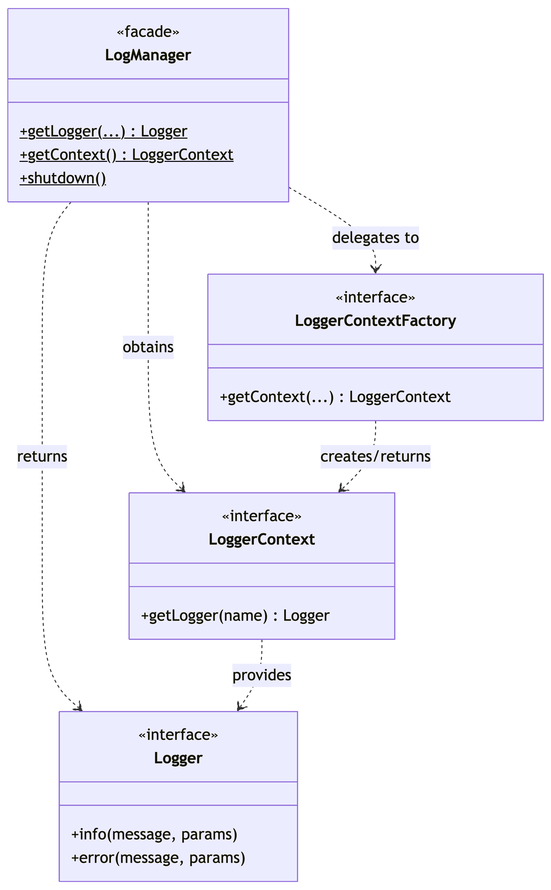
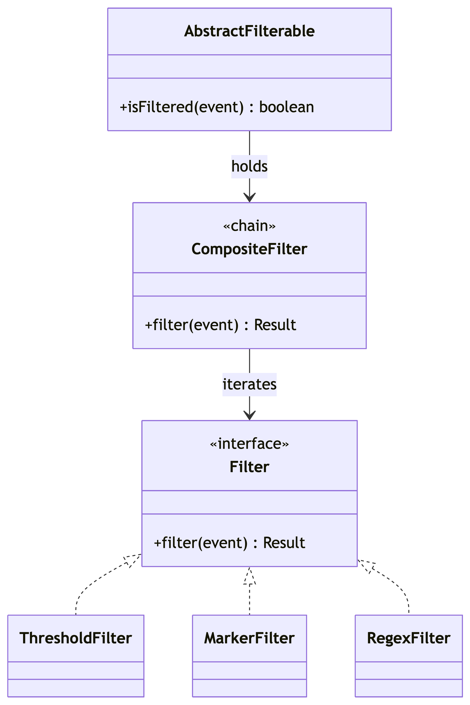

# Report: Software Design

## Table of Contents

- [Report: Software Design](#report-software-design)
  - [Table of Contents](#table-of-contents)
  - [1. Dependencies](#1-dependencies)
    - [1.1 Methodology and Tools](#11-methodology-and-tools)
    - [1.2 Code Dependencies](#12-code-dependencies)
    - [1.3 Knowledge Dependencies](#13-knowledge-dependencies)
  - [2. Patterns](#2-patterns)
    - [2.2 Pattern 2: Facade Pattern](#22-pattern-2-facade-pattern)
      - [Context](#context)
        - [How it works in Log4j](#how-it-works-in-log4j)
    - [2.4 Pattern 4: Chain of Responsibility](#24-pattern-4-chain-of-responsibility)
      - [Context](#context-1)
        - [How it works in Log4j](#how-it-works-in-log4j-1)
  - [3. Summary](#3-summary)
---

## 1. Dependencies

### 1.1 Methodology and Tools

In the following sections, some custom Python scripts were used to perform static analyses of the code. 

For **Code Dependencies**, a static analysis was performed utilizing regular expressions to identify imports within the two core components: log4j-core and log4j-api. Tests and `package-info.java` were excluded from this analysis as they were not considered important for the purpose of this study. 
However, there are some limitations regarding the use of Python scripts compared to the use of professional tools. In fact, in Java language, the imports of intra-package classes are not required. This can cause some variations of the results. Regardless of this, the analysis remains a good metric for the inter-package relationships. 

For **Knowledge Dependencies**, the commit history was extracted from the Apache Log4j Git Repository. Using a Python script, it was possible to filter the commit history for `.java` files and to track how often two files were modified together in the same commit. A minimum threshold of 15 "co-changes" was added to focus only on the most meaningful pairs. 

### 1.2 Code Dependencies

_Evaluate code dependencies based on the imports in the source code._

- **Most/Least dependent files:** _Indicate which files have the most or least dependencies and explain why._

### 1.3 Knowledge Dependencies

Understandably, the results of the Python script showed some obvious connections, like direct dependencies between a class and its testing class (for example, `RingBufferLogEvent.java` changing with `RingBufferLogEventTest.java` 29 times). However, the most interesting dependencies are those where there are no strong links, like structural dependencies, between the files. 

We found some cases in which two files have a high co-change rate but don't actually import each other in the code. These fall into three main architectural patterns: 
1. **Keeping Output Formats in Sync (Layouts):**
   One of the most frequently co-changed pair in the analysis (29 times) was `JsonLayout.java` and `XmlLayout.java`, followed by (22 times) `JsonLayout.java` and `YamlLayout.java`. These files sit in the same package, but they never call each other. They change together because of feature parity: whenever developers add a new detail to the logs, they have to update all the layout files at the same time to make it work in every format.
2. **Standard vs. "Garbage-Free" Implementations:**
   Another pair that has a high co-change rate is `CopyOnWriteSortedArrayThreadContextMap.java` and `GarbageFreeSortedArrayThreadContextMap.java` (36 co-changes). Log4j provides a standard implementation and a "garbage-free" one, for high performance tasks. Since they basically do the same thing differently, every time a change is needed in one of them, it has to be mirrored in the other. 
3. **Configuration and Security Setup:**
    Finally, files that handle configuration or security setup change together. For example, `KeyStoreConfiguration.java` and `TrustStoreConfiguration.java` (26 co-changes) don't interact in the code, but, since they both deal with security certificates, they often change together. The same logic applies to configuration files, for example `JsonConfiguration.java` and `XmlConfiguration.java` (28 co-changes). Since both configuration files do the same operations, configuration behavior must remain consistent across formats. 

In conclusion, the inconsistencies found in Log4j are design choices, not architectural flaws. They are necessary to ensure feature parity, optimize performance, and keep parallel configurations synchronized across independent files. 

## 2. Patterns

### 2.2 Pattern 2: Facade Pattern
**Pattern Category**: Structural

#### Context 
Log4j hides a complex subsystem that include context selection, configuration parsing, plugin discovery, and logger lifecycle management. Application code should not need to know about these internals; it should simply obtain a logger and emit messages.

- **Roles:** 
  - **Facade**: `LogManager.java` 
    provides a single, simplified entry point (`getLogger()`, `getContext()`, `shutdown()`).
  - **Subsystem Interfaces**: `LoggerContetFactory.java ` and `LoggerContext.java`
  - **Subsystem Implementation**: `LoggerContext.java` and `Logger.java`
  - **Client**: Application code uses the facade to obtain a `Logger` from `Logger.java`.

  

  ##### How it works in Log4j 
  The client code calls `LogManager.getLogger(...)` and receivers a `Logger` without knowing which context or configuration format is active. The `LogManager` delegates to the current `LoggerContextFactory` the choice of the correct `LoggerContext` and returns a `Logger`.
  ```java 
  import org.apache.logging.log4j.LogManager;
  import org.apache.logging.log4j.Logger;
  
  public class PaymentService {
    private static final Logger log = LogManager.getLogger(PaymentService.class);

    public void charge(double amount) {
        log.info("Charging amount: {}", amount);
    }
  }
  ```
- **Problem Solved / Rationale:** 
  - *Problems*: 
    - The logging subsystem is large and highly modular. Without the facade, client would have to deal with context selection, configuration parsing, plugin discovery, and lifecycle management. 
    - Logging must be easy to use with minimal boilerplate. 
  - *Solution*: 
    - Provide `LogManager` as a facade that centralizes common operations and delegates some duties to `LoggerContextFactory` and `LoggerContext`.
  
- **Alternatives:** 
  - *Dependency Injection of `LoggerContext`*: A dependency injection container provides `LoggerContext` to classes that need logging. 
    - *Pro*: Dependencies are explicit. 
    - *Cons*: With this alternative the boilerplate code increases and logging becomes harder to use in simple apps. 
  - *Direct Subsystem Access*: Client code calls `LoggerContextFactory` and `LoggerContext` directly, without the `LogManager`.
    - *Pros*: Client code has full control over configuration and lifecycle. Moreover, it becomes easier to reach advanced features. 
    - *Cons*: This solution is more verbose and harder to keep stable across versions. 

### 2.4 Pattern 4: Chain of Responsibility 
**Pattern Category**: Behavioral (Object-Based)

#### Context 
Log4j gives the opportunity to stack several filters on a logger to filter `LogEvent`s. Each filter returns a `Filter.Result` (`ACCEPT`, `NEUTRAL`, or `DENY`).

- **Roles:** 
  - **Handler Interface**: `Filter.java`
  defines `filter(...)` and the possible outcomes (`Filter.Result`).
  - **Concrete Handlers**: `ThresholdFilter.java` (blocks or allows based on level), `MarkerFilter.java` (filters using markers), `RegexFilter.java` (accepts/denies based on a message regex).
  - **Chain Container**: `CompositeFilter.java`
  holds a list of filters and calls them in sequence.
  - **Client**: `AbstractFilterable.java`, `AppenderControl.java`
  `AbstractFilterable.java` is used by wrappers like `AppenderControl.java` and asks the chain if a `LogEvent` should be ignored. 

  

  ##### How it works in Log4j 
  A `Filterable` component has a filter slot. If more filters are needed, Log4j wraps them into a `CompositeFilter`. The method `CompositeFilter.filter(...)` runs each filter in order and stops on the first `ACCEPT` or `DENY`. If all filters return `NEUTRAL`, the event continues. 

  ```java 
  // Key code from CompositeFilter.java
  @Override
  public Result filter(
      final Logger logger, final Level level, final Marker marker, final String msg, final Object... params) {
    Result result = Result.NEUTRAL;
    for (int i = 0; i < filters.length; i++) {
      result = filters[i].filter(logger, level, marker, msg, params);
      if (result == Result.ACCEPT || result == Result.DENY) {
        return result;
      }
    }
    return result;
  }
  ```
- **Problem Solved / Rationale:** 
  - *Problems*: 
    - Need to use multiple filters at the same time. 
    - The system has to let users add or remove filters without changing the core code. 
    - A single big filter is hard to read and test. 
  - *Solution*: 
    Use a filter chain, so each filter gets the chance to handle the event and the chain stops as soon as a decision is made. 
  
- **Alternatives:** 
  - *One giant filter with `if/else` statements*: Implement a single `Filter` class that checks all the conditions in one long `if/else` chain and returns the `Result` directly.
    - *Pro*: All the code is in one class, so it is easy to find.
    - *Cons*: The code grows quickly and becomes hard to understand, to test and risky to change.
  - *Hard-Coded*: Put the filter logic directly inside each appender's method and return early when the event should be skipped. 
    - *Pros*: Direct and fast.
    - *Cons*: The same rules get repeated in multiple appenders. 

## 3. Summary

_Summarize the results regarding the two design aspects (Dependencies and Patterns)._
