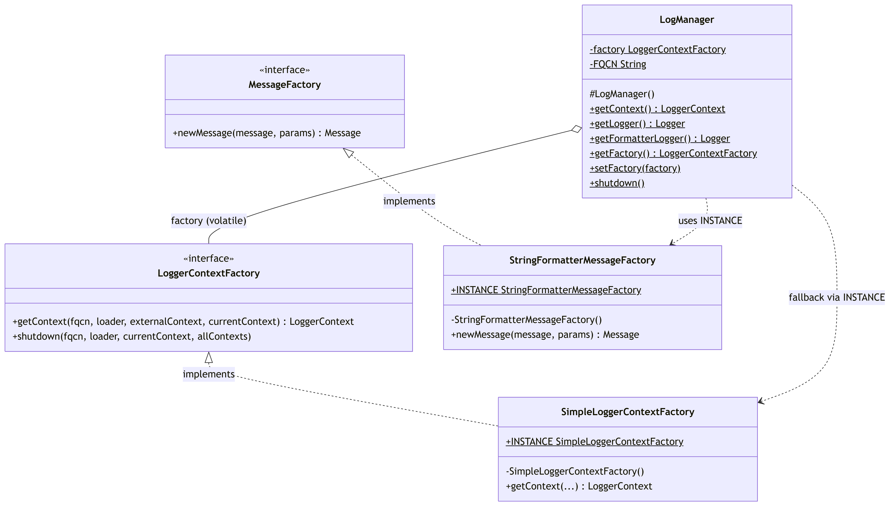
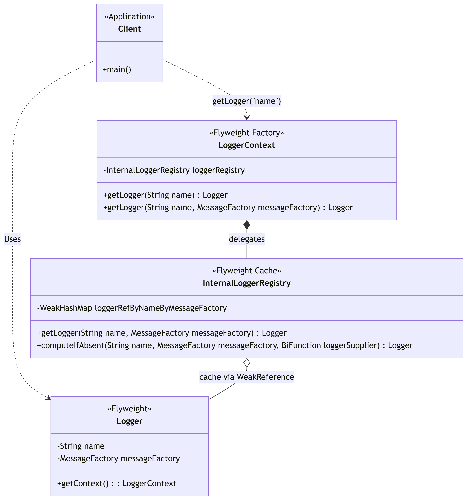
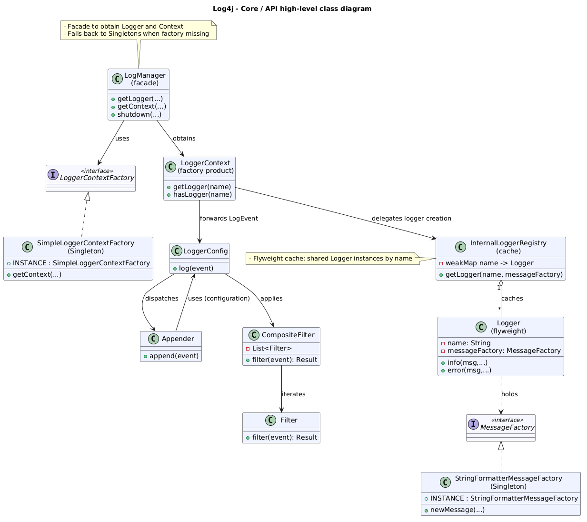

# Report: Software Design

## Table of Contents

- [Report: Software Design](#report-software-design)
  - [Table of Contents](#table-of-contents)
  - [1. Dependencies](#1-dependencies)
    - [1.1 Methodology and Tools](#11-methodology-and-tools)
    - [1.2 Code Dependencies](#12-code-dependencies)
      - [Most dependent files (Highest Fan-out)](#most-dependent-files-highest-fan-out)
      - [Least dependent files (Lowest Fan-out)](#least-dependent-files-lowest-fan-out)
    - [1.3 Knowledge Dependencies](#13-knowledge-dependencies)
  - [2. Patterns](#2-patterns)
    - [2.1 Pattern 1: Singleton Pattern](#21-pattern-1-singleton-pattern)
      - [Context](#context)
        - [How it works in Log4j](#how-it-works-in-log4j)
    - [2.2 Pattern 2: Facade Pattern](#22-pattern-2-facade-pattern)
      - [Context](#context-1)
        - [How it works in Log4j](#how-it-works-in-log4j-1)
    - [2.3 Pattern 3: Flyweight Pattern](#23-pattern-3-flyweight-pattern)
      - [Context](#context-2)
        - [How it works in Log4j](#how-it-works-in-log4j-2)
    - [2.4 Pattern 4: Chain of Responsibility](#24-pattern-4-chain-of-responsibility)
      - [Context](#context-3)
        - [How it works in Log4j](#how-it-works-in-log4j-3)
    - [Core Classes and Method Relationships overview](#core-classes-and-method-relationships-overview)
  - [3. Summary](#3-summary)

---

## 1. Dependencies

### 1.1 Methodology and Tools

In the following sections, some custom Python scripts were used to perform static analyses of the code.

For **Code Dependencies**, a static analysis was performed utilizing regular expressions to identify imports within the two core components: log4j-core and log4j-api. Tests and `package-info.java` were excluded from this analysis as they were not considered important for the purpose of this study.
However, there are some limitations regarding the use of Python scripts compared to the use of professional tools. In fact, in Java language, the imports of intra-package classes are not required. This can cause some variations of the results. Regardless of this, the analysis remains a good metric for the inter-package relationships.

For **Knowledge Dependencies**, the commit history was extracted from the Apache Log4j Git Repository. Using a Python script, it was possible to filter the commit history for `.java` files and to track how often two files were modified together in the same commit. A minimum threshold of 15 "co-changes" was added to focus only on the most meaningful pairs.

### 1.2 Code Dependencies

#### Most dependent files (Highest Fan-out)

_Base path_: ./log4j-core/src/main/java/org/apache/logging/log4j/core

1. config/`AbstractConfiguration.java` - 43 internal imports
2. config/`LoggerConfig.java` - 32 internal imports
3. `LoggerContext.java` - 31 internal imports

AbstractConfiguration.java is the _system orchestrator_: its high fan-out is justified by its role as the main integration point, responsible for initializing, configuring, and managing the logging lifecycle.

LoggerConfig.java acts as a _dispatcher_ between the API and Core layers, forwarding log events to the appropriate Appenders.

LoggerContext.java manages the _runtime state_ of the logging system, maintaining the registry of active Loggers and bridging the two layers.

#### Least dependent files (Lowest Fan-out)

_Base path_: ./log4j-api/src/main/java/org/apache/logging/log4j

1. `BridgeAware.java` - 0 internal imports
2. `LoggingException.java` - 0 internal imports
3. internal/`LogManagerStatus.java` - 0 internal imports

BridgeAware.java is an interface with a single method, _setEntryPoint_, requiring no dependencies by definition.

LoggingException.java extends the Java's standard _RuntimeException_.
Responsable for encapsulate error message caught anywhere in the system.

LogManagerStatus.java is an internal utility tracking the initialization state of LogManager.

Each class has exactly one responsibility and no dependencies - a direct application of the Single Responsibility Principle (SRP).

### 1.3 Knowledge Dependencies

Understandably, the results of the Python script showed some obvious connections, like direct dependencies between a class and its testing class (for example, `RingBufferLogEvent.java` changing with `RingBufferLogEventTest.java` 29 times). However, the most interesting dependencies are those where there are no strong links, like structural dependencies, between the files.

We found some cases in which two files have a high co-change rate but don't actually import each other in the code. These fall into three main architectural patterns:

1. **Keeping Output Formats in Sync (Layouts):**
   One of the most frequently co-changed pair in the analysis (29 times) was `JsonLayout.java` and `XmlLayout.java`, followed by (22 times) `JsonLayout.java` and `YamlLayout.java`. These files sit in the same package, but they never call each other. They change together because of feature parity: whenever developers add a new detail to the logs, they have to update all the layout files at the same time to make it work in every format.
2. **Standard vs. "Garbage-Free" Implementations:**
   Another pair that has a high co-change rate is `CopyOnWriteSortedArrayThreadContextMap.java` and `GarbageFreeSortedArrayThreadContextMap.java` (36 co-changes). Log4j provides a standard implementation and a "garbage-free" one, for high performance tasks. Since they basically do the same thing differently, every time a change is needed in one of them, it has to be mirrored in the other.
3. **Configuration and Security Setup:**
   Finally, files that handle configuration or security setup change together. For example, `KeyStoreConfiguration.java` and `TrustStoreConfiguration.java` (26 co-changes) don't interact in the code, but, since they both deal with security certificates, they often change together. The same logic applies to configuration files, for example `JsonConfiguration.java` and `XmlConfiguration.java` (28 co-changes). Since both configuration files do the same operations, configuration behavior must remain consistent across formats.

In conclusion, the inconsistencies found in Log4j are design choices, not architectural flaws. They are necessary to ensure feature parity, optimize performance, and keep parallel configurations synchronized across independent files.

## 2. Patterns

### 2.1 Pattern 1: Singleton Pattern

**Pattern Category**: Creational (Object-Based)

#### Context

Log4j is a logging framework that serves as a centralized entry point for all logging operations in an application. The framework needs to provide global access to logger instances and configuration management.

LogManager.java is the anchor point for the Log4j logging system. The most common usage of this class is to obtain a named Logger.

- **Roles:**
  - **Singleton:** `SimpleLoggerContextFactory.java` and `StringFormatterMessageFactory.java`. <br> These classes implement the pattern by encapsulating their single instance within a static and final field conventionally named _INSTANCE_.

```java
//Singleton instance of StringFormatterMessageFactory.java
public static final StringFormatterMessageFactory INSTANCE = new StringFormatterMessageFactory();
// Singleton instance of SimpleLoggerContextFactory.java
public static final SimpleLoggerContextFactory INSTANCE = new SimpleLoggerContextFactory();
```

- **Client:** `LogManager.java`. <br> Acts as the Singleton consumer, invoking `SimpleLoggerContextFactory.INSTANCE` as a fallback mechanism or `StringFormatterMessageFactory.INSTANCE` for specific message formatting.

```java
// Returns a formatter Logger with the specified name.
public static Logger getFormatterLogger(final String name) {
    return name == null
            ? getFormatterLogger(StackLocatorUtil.getCallerClass(2))
            : getLogger(name, StringFormatterMessageFactory.INSTANCE);
}


// Returns the current LoggerContext.
public static LoggerContext getContext() {
    try {
        return factory.getContext(FQCN, null, null, true);
    } catch (final IllegalStateException ex) {
        return SimpleLoggerContextFactory.INSTANCE.getContext(FQCN, null, null, true);
    }
}
```

<p align="center">
   
</p>

##### How it works in Log4j

```java
public class ReportService {
    // Static logger for the class
    private static final Logger log = LogManager.getFormatterLogger(ReportService.class);

    public static void main(String[] args) {
        LoggerContext context = LogManager.getContext();
        double balance = 1234.56;

        context.getLogger("TestLogger").info("Test passed!");

        log.info("Sale: %.2f EUR", balance);
    }
}
```

- **Problem Solved / Rationale:**
  - _Problems:_
    - Creating a new object via the `new` keyword every time `LogManager` needs to be called would result in unnecessary memory waste and overhead for the Garbage Collector, especially in a logging framework invoked thousands of times per second.
    - Multiple instantiation of LogManager would lead to inconsistent states and different configurations.
  - _Solution:_
    - The Singleton pattern ensures that one and only one instance of this class exists shared across the entire Java Virtual Machine (JVM). This guarantees a minimal memory footprint, optimal performance, and provides `LogManager` with a unique, global, and immediate access point.

- **Alternatives:**
  - _Static Class:_ The factory could be turned into a class with only static methods.
    - _Pro:_ Simple and fast to implement.
    - _Cons:_ Static methods cannot implement interfaces (e.g. the `LoggerContextFactory` or `MessageFactory` interfaces implemented respectively in _SimpleLoggerContextFactory_ or _StringFormatterMessageFactory_). <br> The Singleton allows leveraging polymorphism, a requirement heavily used in Log4j.
  - _Dependency Injection (DI):_ Inject the factory instance where needed using a Dependency Injection framework.
    - _Pro:_ Reduces tight coupling and greatly simplifies isolation during testing (Mocking).
    - _Cons:_ In a base-level logging infrastructure, requiring dependency injection would force developers to pass the instance to every single class in their application domain, violating ease of use and polluting business logic with infrastructure code (boilerplate).

### 2.2 Pattern 2: Facade Pattern

**Pattern Category**: Structural

#### Context

Log4j hides a complex subsystem that include context selection, configuration parsing, plugin discovery, and logger lifecycle management. Application code should not need to know about these internals; it should simply obtain a logger and emit messages.

- **Roles:**
  - **Facade**: `LogManager.java`
    provides a single, simplified entry point (`getLogger()`, `getContext()`, `shutdown()`).
  - **Subsystem Interfaces**: `LoggerContextFactory.java ` and `LoggerContext.java`
  - **Subsystem Implementation**: `LoggerContext.java` and `Logger.java`
  - **Client**: Application code uses the facade to obtain a `Logger` from `Logger.java`.

<p align="center">
  
</p>

##### How it works in Log4j

The client code calls `LogManager.getLogger(...)` and receivers a `Logger` without knowing which context or configuration format is active. The `LogManager` delegates to the current `LoggerContextFactory` the choice of the correct `LoggerContext` and returns a `Logger`.

```java
import org.apache.logging.log4j.LogManager;
import org.apache.logging.log4j.Logger;

public class PaymentService {
  private static final Logger log = LogManager.getLogger(PaymentService.class);

  public void charge(double amount) {
      log.info("Charging amount: {}", amount);
  }
}
```

- **Problem Solved / Rationale:**
  - _Problems_:
    - The logging subsystem is large and highly modular. Without the facade, client would have to deal with context selection, configuration parsing, plugin discovery, and lifecycle management.
    - Logging must be easy to use with minimal boilerplate.
  - _Solution_:
    - Provide `LogManager` as a facade that centralizes common operations and delegates some duties to `LoggerContextFactory` and `LoggerContext`.
- **Alternatives:**
  - _Dependency Injection of `LoggerContext`_: A dependency injection container provides `LoggerContext` to classes that need logging.
    - _Pro_: Dependencies are explicit.
    - _Cons_: With this alternative the boilerplate code increases and logging becomes harder to use in simple apps.
  - _Direct Subsystem Access_: Client code calls `LoggerContextFactory` and `LoggerContext` directly, without the `LogManager`.
    - _Pros_: Client code has full control over configuration and lifecycle. Moreover, it becomes easier to reach advanced features.
    - _Cons_: This solution is more verbose and harder to keep stable across versions.

### 2.3 Pattern 3: Flyweight Pattern

**Pattern Category**: Structural (Object-Based)

#### Context

`LoggerContext.java` acts as the manager for loggers, ensuring that requests for the same logger name always return the exact same shared instance.

- **Roles:**
  - **Flyweight Factory:** `LoggerContext.java`, utilizing `InternalLoggerRegistry.java`.
    <br> When a client requests a logger, the factory checks if a logger with that specific name already exists in the registry. If it does, it returns the existing instance; if not, it creates a new one, stores it, and returns it.

```java
// LoggerContext.java
public Logger getLogger(final String name, final MessageFactory messageFactory) {

    // Flyweight pattern
    return loggerRegistry.computeIfAbsent(name, MessageFactory, this::newInstance);
}
```

```java
// InternalLoggerRegistry.java
public Logger computeIfAbsent(...) {
    // If the logger already exists, it returns the existing Flyweight instance
    Logger logger = getLogger(name, messageFactory);
    if (logger != null) {
        return logger;
    }

    Logger newLogger = loggerSupplier.apply(name, messageFactory);
    return newLogger;
}
```

- **Flyweight:** `Logger.java` the instance created and returned by `LoggerContext.java`. It is represented by the name and by the `MessageFactory`

- **Client:** `LogManager.java` or any application classes that request the creation of a logger using `LogManager.getLogger()`.

<p align="center">
  
</p>

##### How it works in Log4j

```java
public class Main {
    public static void main(String[] args) {
        Logger logger1 = LogManager.getLogger("TestLogger");
        Logger logger2 = LogManager.getLogger("TestLogger");

        System.out.println(logger1 == logger2); // Output: true
    }
}
```

- **Problem Solved / Rationale:**
  - _Problems:_
    - Creating a unique `Logger` object for every class in the application would cause a massive memory footprint and slow bootstrapping time
  - _Solution:_
    - The Flyweight pattern minimizes memory usage by sharing loggers with the same name and message.

- **Alternatives:**
  - _No Caching_ instantiating a new Logger every time `getLogger()` is called:
    - _Pro:_ Less complex code, no need to manage complex lock
    - _Cons:_ Massive memory waste and performance degradation

### 2.4 Pattern 4: Chain of Responsibility

**Pattern Category**: Behavioral (Object-Based)

#### Context

Log4j gives the opportunity to stack several filters on a logger to filter `LogEvent`s. Each filter returns a `Filter.Result` (`ACCEPT`, `NEUTRAL`, or `DENY`).

- **Roles:**
  - **Handler Interface**: `Filter.java`
    defines `filter(...)` and the possible outcomes (`Filter.Result`).
  - **Concrete Handlers**: `ThresholdFilter.java` (blocks or allows based on level), `MarkerFilter.java` (filters using markers), `RegexFilter.java` (accepts/denies based on a message regex).
  - **Chain Container**: `CompositeFilter.java`
    holds a list of filters and calls them in sequence.
  - **Client**: `AbstractFilterable.java`, `AppenderControl.java`
    `AbstractFilterable.java` is used by wrappers like `AppenderControl.java` and asks the chain if a `LogEvent` should be ignored.

<p align="center">
  
</p>

##### How it works in Log4j

A `Filterable` component has a filter slot. If more filters are needed, Log4j wraps them into a `CompositeFilter`. The method `CompositeFilter.filter(...)` runs each filter in order and stops on the first `ACCEPT` or `DENY`. If all filters return `NEUTRAL`, the event continues.

```java
// Key code from CompositeFilter.java
@Override
public Result filter(
    final Logger logger, final Level level, final Marker marker, final String msg, final Object... params) {
  Result result = Result.NEUTRAL;
  for (int i = 0; i < filters.length; i++) {
    result = filters[i].filter(logger, level, marker, msg, params);
    if (result == Result.ACCEPT || result == Result.DENY) {
      return result;
    }
  }
  return result;
}
```

- **Problem Solved / Rationale:**
  - _Problems_:
    - Need to use multiple filters at the same time.
    - The system has to let users add or remove filters without changing the core code.
    - A single big filter is hard to read and test.
  - _Solution_:
    Use a filter chain, so each filter gets the chance to handle the event and the chain stops as soon as a decision is made.
- **Alternatives:**
  - _One giant filter with `if/else` statements_: Implement a single `Filter` class that checks all the conditions in one long `if/else` chain and returns the `Result` directly.
    - _Pro_: All the code is in one class, so it is easy to find.
    - _Cons_: The code grows quickly and becomes hard to understand, to test and risky to change.
  - _Hard-Coded_: Put the filter logic directly inside each appender's method and return early when the event should be skipped.
    - _Pros_: Direct and fast.
    - _Cons_: The same rules get repeated in multiple appenders.

### Core Classes and Method Relationships overview

<p align="center">
  
</p>

## 3. Summary

**Dependencies**: The analysis of _Code Dependencies_ proves that components with the highest fan-out act as central orchestrators and lifecycle managers, justifying their high coupling. Instead, low fan-out classes represent isolated, single-responsibility utilities.

The analysis of _Knowledge Dependencies_ proves that the inconsistencies found in Log4j are design choices, not architectural flaws. They are necessary to ensure feature parity, optimize performance, and keep parallel configurations synchronized across independent files.

**Design Patterns**: Log4j relies on classic patterns to solve recurring structural and creational problems without compromising performance:

- **Memory and Performance Optimization:** The **Singleton** pattern and the **Flyweight** pattern are strategically employed to prevent massive memory footprints and reduce the workload on the Garbage Collector. They ensure that heavily requested objects are instantiated only once and safely shared across the JVM.
- **Structural Complexity Management:** The **Facade** pattern hides the complexity of sub-systems, providing the end-user with a clean API.
- **Behavioral Flexibility:** The **Chain of Responsibility** pattern empowers the framework with a pluggable, highly customizable filtering mechanism, allowing developers to stack multiple evaluation rules dynamically without altering the core appender logic.
